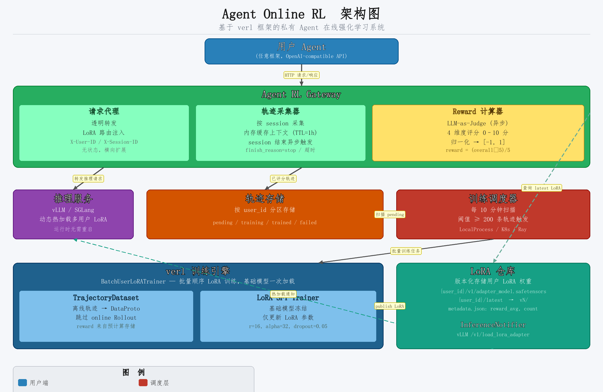

# Agent Online RL 框架设计文档

**日期：** 2026-03-27
**状态：** 已确认设计
**目标：** 基于 verl 框架，构建一套"越用越聪明"的私有 Agent 在线强化学习系统

---

## 1. 背景与目标

用户私有 Agent 在与推理服务交互的过程中会产生大量真实轨迹数据。通过对这些数据计算 reward 并定期触发强化学习训练，可以为每个用户训练专属的 LoRA 参数，使 Agent 持续适应用户偏好，做到"越用越贴心"。

**核心流程（Agent Online RL）：**

1. Gateway 拦截 Agent ↔ 推理服务之间的所有请求，录制完整轨迹
2. 轨迹完成后，使用 LLM-as-Judge 异步计算 reward 并存储
3. 每 10 分钟扫描各用户的待训练轨迹数量，达到阈值时批量触发训练
4. 单次训练任务在同一集群内顺序为多个用户训练独立 LoRA
5. LoRA 训练完成后上传仓库，通知推理服务热加载，用户下次请求即生效

**规模假设：** 中等 SaaS，数百至数千用户，每人持有独立私有 LoRA。

---

## 2. 整体架构



### 六大核心组件

| 组件 | 职责 |
|------|------|
| **Agent RL Gateway** | 透明代理 + 轨迹录制 + 触发 Reward 计算 + LoRA 路由注入 |
| **轨迹存储** | 按 `user_id` 分区，存储完整 session 轨迹及 reward 分数 |
| **训练调度器** | 每 10 分钟扫描，批量收集满足阈值的用户，提交单次批量训练任务 |
| **verl 训练引擎** | 基础模型一次加载，顺序为每个用户训练 LoRA，支持增量训练 |
| **LoRA 仓库** | 版本化存储用户 LoRA 权重，维护 `latest` 软链 |
| **推理服务** | vLLM/SGLang，运行时动态热加载多用户 LoRA |

---

## 3. Agent RL Gateway

### 3.1 请求生命周期

```
Agent 请求 (POST /v1/chat/completions)
    │
    ├─ 1. 解析 headers: X-User-ID, X-Session-ID
    ├─ 2. 查询 LoRA 仓库：该用户是否有已训练的 LoRA？
    │        ├─ 有 → 注入 lora_name 到请求，转发推理服务
    │        └─ 无 → 直接转发基础模型
    │
    ├─ 3. 录制请求 (messages, tools, timestamp)
    ├─ 4. 流式/非流式转发推理服务，获取响应
    ├─ 5. 录制响应 (content, tool_calls, finish_reason)
    │
    └─ 6. session 结束时（finish_reason=stop 或超时）：
             └─ 异步提交完整轨迹到 Reward 计算器
```

### 3.2 核心数据结构

```python
@dataclass
class Trajectory:
    trajectory_id: str      # uuid
    user_id: str
    session_id: str
    turns: List[Turn]       # 多轮对话
    tool_calls: List[ToolCall]
    created_at: datetime
    reward: float | None    # 由 Reward 计算器填入，范围 [-1, 1]
    reward_details: dict    # Judge 打分细节
    metadata: dict          # agent 类型、模型版本等

@dataclass
class Turn:
    role: str               # user / assistant / tool
    content: str
    timestamp: datetime
    token_count: int
```

### 3.3 关键设计决策

- **无状态 Gateway**：session 上下文存 Redis（TTL=1h），支持横向扩展
- **异步 Reward 计算**：LLM-as-Judge 不阻塞主链路延迟
- **鉴权职责分离**：`X-User-ID` 由上层 API 网关注入，Gateway 不做鉴权

---

## 4. Reward 计算器（LLM-as-Judge）

### 4.1 打分 Prompt

```python
JUDGE_PROMPT_TEMPLATE = """
你是一个专业的 AI Agent 质量评估器。请对以下 Agent 对话轨迹打分。

## 对话轨迹
{trajectory_text}

## 评分维度（各 0-10 分）
1. 任务完成度：Agent 是否完成了用户意图？
2. 响应质量：回答是否准确、有帮助、简洁？
3. 工具使用合理性：工具调用是否必要且正确？
4. 对话连贯性：多轮对话是否自然流畅？

请以 JSON 格式返回：
{"task_completion": 8, "response_quality": 7, "tool_usage": 9,
 "coherence": 8, "overall": 8.0, "reason": "..."}
"""
```

### 4.2 归一化

`reward = (overall - 5.0) / 5.0`，映射到 `[-1.0, 1.0]`，overall=5 对应 reward=0（中性）。

---

## 5. 训练调度器

### 5.1 触发机制

每 10 分钟扫描所有活跃用户，批量收集达到阈值的用户，提交单次批量训练任务：

```
扫描周期：10 分钟

对所有活跃用户：
  eligible_users = [u for u if pending_count(u) >= THRESHOLD]  # 默认 200 条

若 eligible_users 非空：
  ├─ 将这批用户的轨迹全部标记为 "training"
  └─ 提交一个批量训练任务：
       ResourceScheduler.submit_batch_training_job(
           users=[{user_id, trajectory_ids}, ...]
       )
```

**批量提交的优势**：单次集群申请摊薄启动开销，多用户共享同一基础模型加载成本。

### 5.2 ResourceScheduler 抽象接口

```python
class ResourceScheduler(ABC):
    @abstractmethod
    def submit_batch_training_job(
        self, user_jobs: List[UserTrainingJob]
    ) -> str:
        """提交批量训练任务，返回 job_id"""

    @abstractmethod
    def get_job_status(self, job_id: str) -> JobStatus: ...

    @abstractmethod
    def cancel_job(self, job_id: str) -> None: ...

# 内置实现
class LocalProcessScheduler(ResourceScheduler): ...   # 本地进程，开发调试用
class K8sJobScheduler(ResourceScheduler): ...         # K8s Job
class RayJobScheduler(ResourceScheduler): ...         # Ray Job（与 verl 天然集成）
```

---

## 6. verl 训练引擎（批量顺序 LoRA 训练）

### 6.1 与 verl 标准流程的差异

```
verl 标准流程:
  DataLoader → RolloutWorker（在线采样）→ RewardModel → PPO/GRPO 更新

Agent Online RL 适配:
  TrajectoryDataset（离线轨迹）→ 跳过 Rollout → RewardFromStore（已预计算）→ PPO/GRPO 更新
                                                                              └─ 仅更新 LoRA 参数
```

### 6.2 批量顺序训练循环

```python
class BatchUserLoRATrainer:
    """
    基础模型只加载一次，全程冻结。
    LoRA 适配器在用户间顺序重置复用。
    """
    def __init__(self, base_model_path: str, verl_config):
        self.actor = load_frozen_base_model(base_model_path)
        self.verl_config = verl_config

    def run(self, user_batch: List[UserTrainingJob]):
        for job in user_batch:
            try:
                self._train_one_user(job)
            except Exception as e:
                # 单用户失败不影响其他用户，回滚轨迹状态
                trajectory_store.mark_failed(job.user_id, job.trajectory_ids)
                logger.error(f"Training failed for user {job.user_id}: {e}")

    def _train_one_user(self, job: UserTrainingJob):
        # 1. 初始化或加载历史 LoRA（支持增量训练）
        lora_adapter = self._init_lora(job.user_id)
        self.actor.set_lora(lora_adapter)

        # 2. 加载该用户的轨迹数据
        dataset = TrajectoryDataset(job.user_id, job.trajectory_ids)

        # 3. 复用 verl PPO/GRPO 更新逻辑，仅更新 LoRA 参数
        trainer = verl.trainer.LoRATrainer(
            actor=self.actor,
            dataset=dataset,
            config=self.verl_config,
        )
        trainer.train()

        # 4. 导出 LoRA，上传仓库，通知推理服务热更新
        lora_weights = self.actor.export_lora()
        lora_repo.publish(job.user_id, lora_weights)
        inference_notifier.notify_update(job.user_id)

        # 5. 清除 LoRA 权重，准备下一个用户
        self.actor.reset_lora()

    def _init_lora(self, user_id: str):
        """优先加载历史 LoRA（增量训练），否则随机初始化。"""
        existing = lora_repo.get_latest(user_id)
        return load_lora(existing.path) if existing else init_random_lora(self.verl_config.lora)
```

### 6.3 verl 配置（LoRA 专项）

```yaml
# config/ppo_lora_trainer.yaml
model:
  freeze_base: true
  lora:
    enable: true
    r: 16
    alpha: 32
    target_modules: [q_proj, v_proj, k_proj, o_proj]
    dropout: 0.05

trainer:
  skip_rollout: true          # 使用离线轨迹，跳过在线采样
  reward_from_data: true      # reward 来自数据集，不调用 reward model
```

### 6.4 自定义 Dataset

```python
class TrajectoryDataset(torch.utils.data.Dataset):
    def __init__(self, user_id: str, trajectory_ids: List[str]):
        self.trajectories = trajectory_store.load(user_id, trajectory_ids)

    def __getitem__(self, idx) -> DataProto:
        traj = self.trajectories[idx]
        return DataProto(
            input_ids=tokenize_trajectory(traj.turns),
            attention_mask=...,
            rewards=torch.tensor([traj.reward]),  # 预计算 reward
        )
```

---

## 7. LoRA 仓库 + 推理服务热加载

### 7.1 LoRA 仓库结构

```
lora_repo/
└── {user_id}/
    ├── v1/
    │   ├── adapter_model.safetensors
    │   └── metadata.json   # {"created_at", "trajectory_count", "base_model", "reward_avg"}
    ├── v2/
    │   └── ...
    └── latest -> v2/       # 符号链接，推理服务始终读 latest
```

### 7.2 热加载流程

```python
class InferenceNotifier:
    def notify_update(self, user_id: str):
        lora_version = lora_repo.get_latest(user_id)
        # vLLM 原生支持运行时 LoRA 加载，无需重启
        self.vllm_client.post("/v1/load_lora_adapter", json={
            "lora_name": user_id,
            "lora_path": lora_version.path,
        })
```

**完整热加载生命周期：**

```
BatchUserLoRATrainer._train_one_user() 完成
  → lora_repo.publish()                  # 写文件 + 更新 latest 软链
  → inference_notifier.notify_update()   # 调用 vLLM load_lora_adapter API
  → vLLM 异步加载（不阻塞其他用户推理）
  → 该用户下一个请求自动使用新 LoRA
```

### 7.3 Gateway LoRA 路由注入

```python
def proxy_request(self, request: ChatRequest, user_id: str):
    latest = lora_repo.get_latest(user_id)
    if latest:
        request.extra_body["lora_name"] = user_id   # vLLM 扩展字段
    return self.vllm_client.forward(request)
```

---

## 8. 目录结构建议

```
agent-online-rl/
├── gateway/
│   ├── proxy.py              # 请求代理 + LoRA 路由注入
│   ├── recorder.py           # 轨迹录制器
│   └── reward_computor.py    # LLM-as-Judge
├── storage/
│   ├── trajectory_store.py   # 轨迹存储（按用户分区）
│   └── lora_repo.py          # LoRA 版本化仓库
├── scheduler/
│   ├── training_scheduler.py # 10 分钟扫描 + 批量触发
│   └── resource_scheduler.py # ResourceScheduler 抽象 + 内置实现
├── trainer/
│   ├── batch_lora_trainer.py # BatchUserLoRATrainer
│   ├── trajectory_dataset.py # TrajectoryDataset（verl DataProto）
│   └── train_user_lora.py    # 训练入口脚本
├── inference/
│   └── notifier.py           # InferenceNotifier（vLLM 热加载）
└── config/
    └── ppo_lora_trainer.yaml # verl 训练配置
```

---

## 9. 关键设计决策汇总

| 决策点 | 选择 | 理由 |
|--------|------|------|
| Reward 计算 | LLM-as-Judge 异步 | 无需人工标注，自动化程度高 |
| 训练触发 | 数量阈值 + 定时扫描 | 批量提交摊薄集群启动成本 |
| LoRA 推理加载 | vLLM 动态热加载 | 无重启，不影响其他用户 |
| 多用户训练 | 单集群顺序训练 | 基础模型一次加载，资源高效 |
| 增量训练 | 优先加载历史 LoRA | 每轮训练在上一版本基础上持续改进 |
| 资源调度 | 可插拔抽象接口 | 支持本地/K8s/Ray 多种后端 |
| 容错 | 单用户失败隔离 | try/except + 轨迹状态回滚 |
